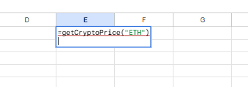
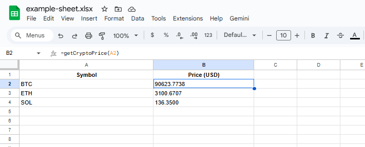
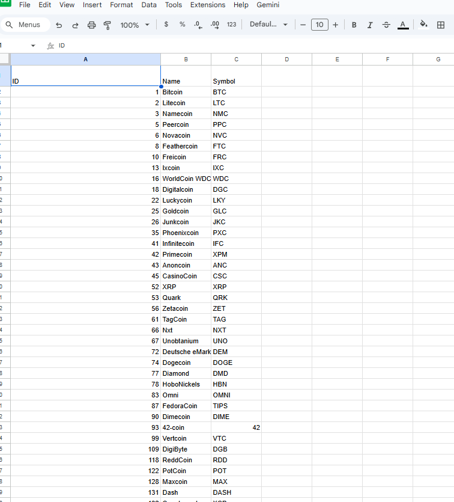

# CryptoSheet Oracle

CryptoSheet Oracle is an open-source Google Apps Script tool that brings real-time cryptocurrency prices into Google Sheets using the CoinMarketCap API.

It focuses on simplicity, performance, and safe API usage through built-in caching.

---

## Why CryptoSheet Oracle

- Fully open-source and transparent
- No external dependencies
- Designed for real-world spreadsheets
- Safe API key handling
- Optimized for free CoinMarketCap API limits

---

## Features

- Live crypto prices in USD
- Supports all CoinMarketCap-listed cryptocurrencies
- Formula-based usage inside Google Sheets
- Bulk price updates
- Script Cache to minimize API calls
- Error recovery utilities
- Symbol or CoinMarketCap ID lookup

---

## Use Cases

- Crypto portfolio tracking
- Investment dashboards
- Personal finance automation
- Research and education
- Open-source learning projects

---

## Screenshots

### Formula usage inside Google Sheets

### Automatic price updates in table

### Import full cryptocurrency list

---

## Installation

### 1. Get a CoinMarketCap API Key

Create a free account on CoinMarketCap and generate an API key.

---

### 2. Configure Script Properties

To keep credentials secure, the API key must be stored in Script Properties.

In Google Apps Script:
1. Open **Project Settings**
2. Add a Script Property

